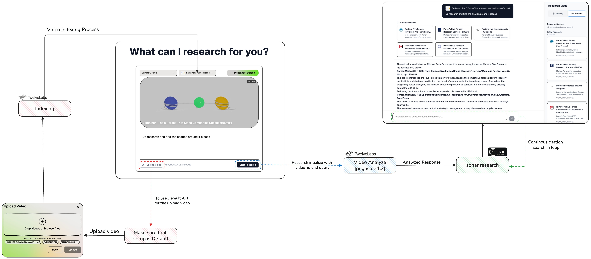

## Overview

**Video Deep Research** is a platform that enables intelligent video analysis, deep research, and reliable citation extraction. Unlike traditional search engines, which cannot directly search inside videos or provide verifiable references, Here **TwelveLabs Analyze Pegasus 1.2** for video understanding and **Sonar by Perplexity** for knowledge retrieval and citation.

This enables researchers, creators, and professionals to explore video content at a semantic level, generate structured insights, and link them with verifiable sources.


## Prerequisites

* Python 3.9+
* Flask
* Twelve Labs Analyze (Pegasus 1.2) – [Get API Key](https://www.twelvelabs.io/)
* Perplexity Sonar API – [Get API Key](https://sonar.perplexity.ai/)

## Features

1. Video content is processed and analyzed using **TwelveLabs Pegasus 1.2**
2. Extracted insights are enriched with **Sonar by Perplexity** to provide citations
3. Semantic search enables **deep video understanding** beyond keywords
4. Returns **verified research outputs** with proper references

## Core Workflow Architecture




## File Structure

The frontend is built with **Next.js**, while the backend runs on **Flask** with CORS enabled.

```
├── README.md
├── backend
    ├── .gitignore
    ├── README.md
    ├── __pycache__
    │   └── app.cpython-312.pyc
    ├── app.log
    ├── app.py
    ├── requirements.txt
    ├── routes
    │   ├── __init__.py
    │   ├── __pycache__
    │   │   ├── __init__.cpython-312.pyc
    │   │   └── api_routes.cpython-312.pyc
    │   └── api_routes.py
    └── service
    │   ├── __init__.py
    │   ├── __pycache__
    │       ├── __init__.cpython-312.pyc
    │       ├── firebase_service.cpython-312.pyc
    │       ├── sonar_service.cpython-312.pyc
    │       └── twelvelabs_service.cpython-312.pyc
    │   ├── sonar_service.py
    │   └── twelvelabs_service.py
└── www.videoresearch.app
    ├── .gitignore
    ├── app
        ├── globals.css
        ├── layout.tsx
        ├── loading.tsx
        ├── page.tsx
        └── page.tsx.backup
    ├── components.json
    ├── components
        ├── InlineVideoPlayer.tsx
        ├── VideoPlayer.tsx
        ├── theme-provider.tsx
        └── ui/
    ├── hooks
        ├── use-mobile.ts
        └── use-toast.ts
    ├── lib
        ├── config.ts
        └── utils.ts
    ├── next.config.mjs
    ├── package-lock.json
    ├── package.json
    ├── pnpm-lock.yaml
    ├── postcss.config.mjs
    ├── public/
    ├── styles
        └── globals.css
    ├── temp_footer.txt
    ├── temp_page.tsx
    └── tsconfig.json

```

## API Key Setup

### TwelveLabs Setup

1. Sign up at [Twelve Labs](https://www.twelvelabs.io/)
2. Generate your **TwelveLabs API Key**

### Perplexity Sonar Setup

1. Sign up at [Sonar Perplexity](https://sonar.perplexity.ai/)
2. Get API credentials for **Sonar API**

### Configure `.env`

```
TWELVELABS_API_KEY=your_twelvelabs_api_key
SONAR_API_KEY=your_perplexity_sonar_api_key
```

## Installation

Clone the repository

```bash
git clone https://github.com/Hrishikesh332/TwelveLabs-Video-DeepResearch.git
```

### Backend Setup

```bash
cd backend
python -m venv venv
source venv/bin/activate   # On Windows: venv\Scripts\activate
pip install -r requirements.txt
```

Run the backend:

```bash
python app.py
```

Backend runs at - [http://localhost:5000](http://localhost:5000)

### Frontend Setup

```bash
cd www.videoresearch.app
npm install --legacy-peer-deps
```

Create `.env.local` in frontend:

```
NEXT_PUBLIC_API_URL=http://localhost:5000
```

Run frontend:

```bash
npm run dev
```

Frontend runs at - [http://localhost:3000](http://localhost:3000)

## API Usage

For the API documentation and the usage, do check the README in backend/

## Queries

For any doubts or help, feel free to reach out via email: **[hrishikesh3321@gmail.com](mailto:hrishikesh3321@gmail.com)**
Or open an issue in this repo.
